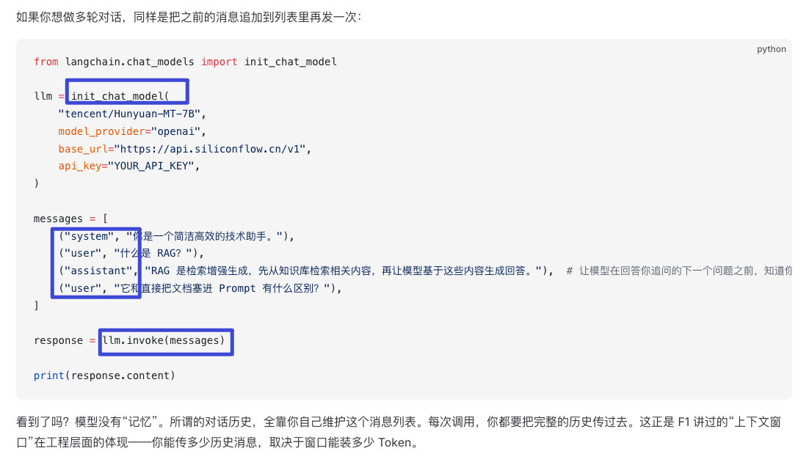
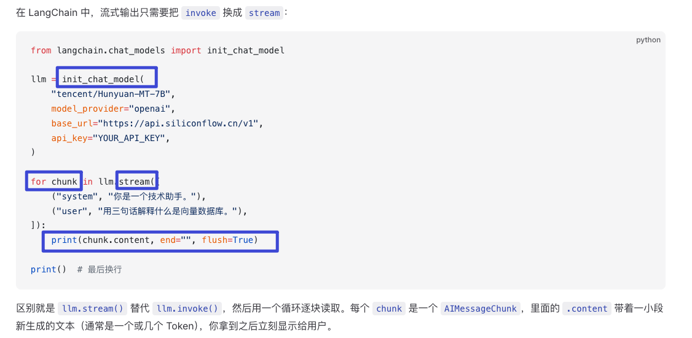
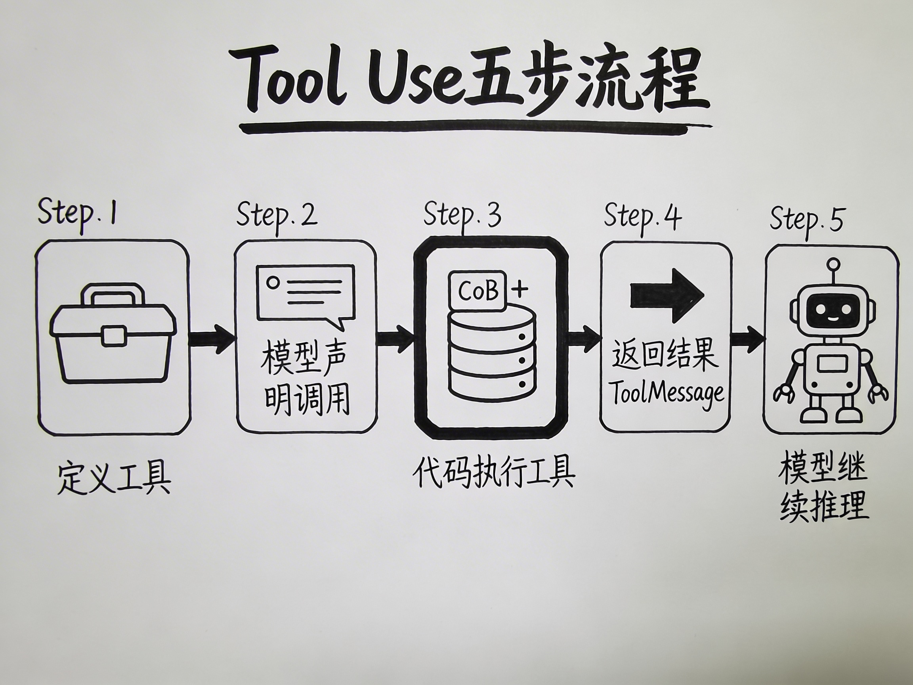
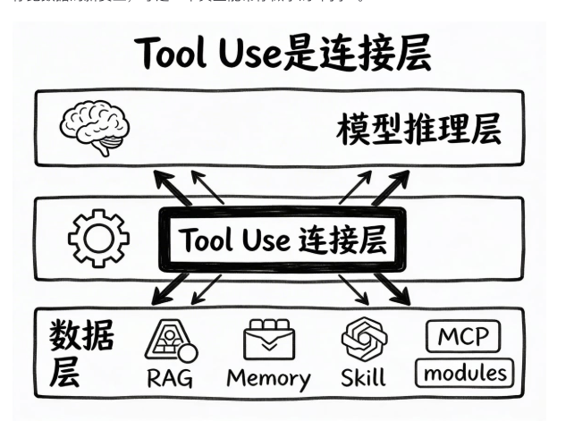
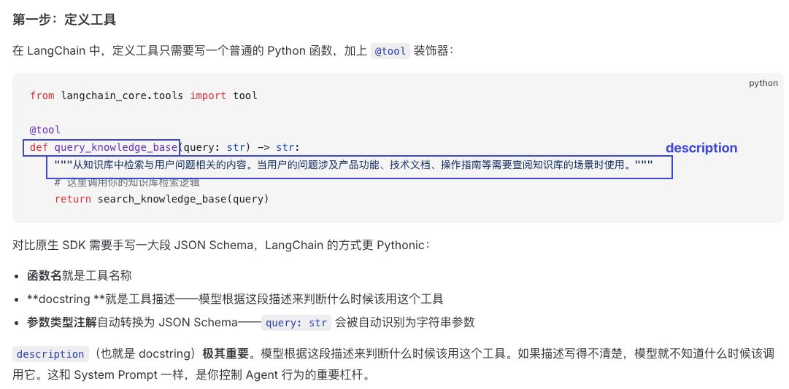
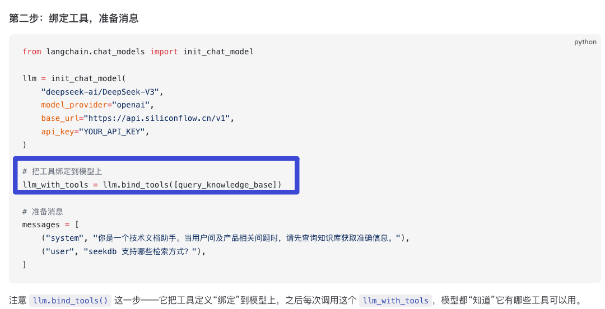
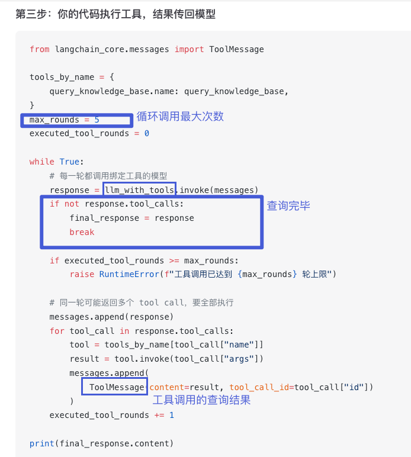

## Takeaway
本质而言，Agent 的工具调用是把工具的 description 插入 system prompt，再由模型按需发起查询。工具调用是模型与外部数据（RAG、记忆、Skill、MCP）之间的连接层。

## 学习过程中的随笔
<!-- 纯文字随笔用 text-thought，配图随笔用 note-figure；图片很宽或自带正文时加 is-wide -->

  
01
LangChain 和厂商 SDK 的区别：LangChain 在原生 OpenAI SDK 之上提供了更高层的抽象——统一的模型接口、标准化的工具调用、便捷的流式处理，让你用更少的代码做更多的事。更重要的是，未来切换模型供应商（从 OpenAI 换到 Anthropic、Google 等）时，LangChain 的代码几乎不用改。

  <figure class="note-figure is-wide">
    <figcaption>02
调用大模型 API 的基本写法（非流式）：模型本身没有“记忆”，所谓对话历史全靠自己维护这个消息列表，每次调用都要把完整历史传过去。这就是 F1 讲的“上下文窗口”在工程层面的体现。
</figcaption>
    
  </figure>
  <figure class="note-figure is-wide">
    <figcaption>03
流式写法只需要把 <code>invoke()</code> 换成 <code>stream()</code>，再用循环逐块读取。每个 chunk 是一个 AIMessageChunk，<code>.content</code> 里带着新生成的一小段文本（通常一到几个 Token），拿到就立刻显示给用户。
</figcaption>
    
  </figure>
  <figure class="note-figure">
    <figcaption>04
工具调用（tool use / function calling）的五步流程：定义工具 → 模型声明调用 → 代码执行工具 → 返回 ToolMessage → 模型继续推理。注意真正执行工具的是你的代码，模型只负责“声明要调用什么”。
</figcaption>
    
  </figure>
  <figure class="note-figure">
    <figcaption>05
我原本以为 Skill 属于 tool use 层，其实 tool use 本身是连接层：上接模型推理层，下接数据层的 RAG、Memory、Skill、MCP modules。
</figcaption>
    
  </figure>
  <figure class="note-figure is-wide">
    <figcaption>06
第一步，定义工具：在 LangChain 里只要写一个普通 Python 函数加上 <code>@tool</code> 装饰器——函数名就是工具名，docstring 就是工具描述，参数类型注解自动转成 JSON Schema。description 极其重要，它和 System Prompt 一样是控制 Agent 行为的重要杠杆。
</figcaption>
    
  </figure>
  <figure class="note-figure is-wide">
    <figcaption>07
第二步，绑定工具：<code>llm.bind_tools()</code> 把工具定义绑到模型上，之后每次调用 <code>llm_with_tools</code>，模型都“知道”它有哪些工具可用。
</figcaption>
    
  </figure>
  <figure class="note-figure is-wide">
    <figcaption>08
第三步，执行工具并把结果传回模型：用 while 循环反复调用绑定工具的模型，没有 tool_calls 就说明查询完毕；同一轮可能返回多个 tool call，要全部执行后以 ToolMessage 追加回消息列表。这里要加 max_rounds 做循环上限兜底。
</figcaption>
    
  </figure>

