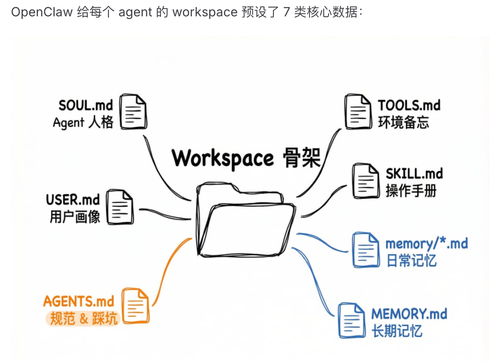

## Takeaway

在我眼里OpenClaw 最核心的吸引力，是用本地文件管理数据，并让每个 Agent 拥有独立 workspace。记忆、上下文与任务数据因此更干净、更有针对性，也更容易迁移。

## 学习过程中的随笔

### 仍然存在的使用需求

虽然 OpenClaw 的热度已经下降，各家产品也加入了定时任务和远程控制机制，但我仍会使用这类工具。
我的 OpenClaw Agent 主要承担生活陪伴角色，例如关注身体健康的中医 Agent，以及负责发现生活乐趣的 ENFP Agent。

我思考了一下，openclaw最核心的吸引力确实是本地文件数据管理 + 每个agent一个workspace带来的吸引力。
这样的设计，让记忆、上下文和任务的数据不仅干净、具有针对性，并且容易迁移。

即使我从openclaw迁移到qclaw再迁移到work buddy，整个过程也只需要和具有电脑文件访问权限的ai说一声即可。
唯一麻烦的就是IM途径的迁移，而不是Agent的数据本身。
相比之下，网页端AI的记忆和任务迁移，就要大费周章了。

迄今为止，我都无法在claude code和codex的agent上感受到生活agent的陪伴感，他们更像是办公助手和咨询对象。
也许这就是缺少了SOUL.md的通用agent痛点吧，没有独特定位和灵魂的agent无法成为朋友。

