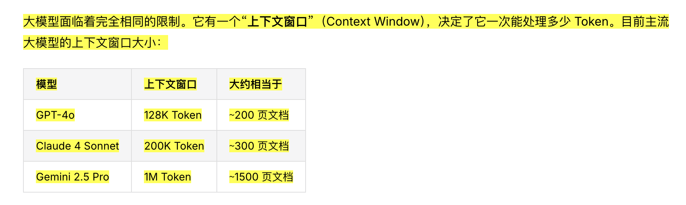

## Takeaway
Agent中的核心数据，除了训练模型的数据，还有实时数据（web search等技能接入数据） + 用户使用数据（记忆系统和agent设定等常驻上下文的数据） + 系统性数据（rag）

## 学习过程中的随笔
这一章属于基本认知了，感觉是从数据的角度再次强化理解agent的优化

  <figure class="note-figure">
    <figcaption>01
常听说“超长上下文”，但直到这次才对上下文窗口相当于多少页文档有了具体感觉。
</figcaption>
    
  </figure>

