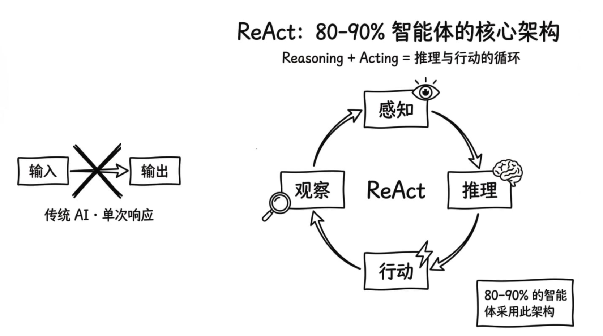
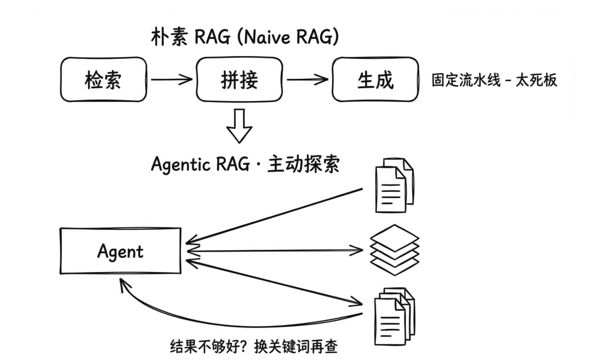
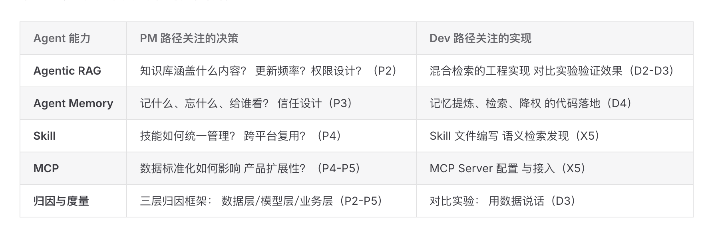

## Takeaway
通过可视化，强化理解了容易混淆的概念——LangChain和LangGraph｜MCP、function call、CLI｜朴素RAG和agentic RAG，后续学习需要更多关注实现的区别

## 学习过程中的随笔

  <figure class="note-figure">
    <figcaption>02
过去接触过很多 Agent 架构，反而目不暇接。先识别主流框架，让知识更容易被吸收。
</figcaption>
    
  </figure>
  <figure class="note-figure">
    <figcaption>03
LangChain 和 LangGraph 的区别以前总说不直白，这张图第一次把关系讲清楚了。
</figcaption>
    
  </figure>
  <figure class="note-figure">
    <figcaption>04
朴素 RAG 与 Agentic RAG 的差异已经看见，但 Agentic RAG 的实现方式仍是后续重点。
</figcaption>
    
  </figure>
  
05
MCP、function call 和 CLI 仍然容易混淆，需要用真实例子反复区分，而不是只记定义。

  <figure class="note-figure">
    <figcaption>06
能看懂一段描述，不代表知道如何实现。把“看懂但不会做”明确记为后续学习重点。
</figcaption>
    
  </figure>
  <figure class="note-figure">
    <figcaption>07
作为产品经理，我很好奇开发人员在同一套工具链中的执行方式和观察视角。
</figcaption>
    
  </figure>

