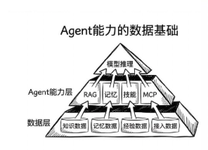

## Takeaway

## 学习过程中的随笔
- 为什么技能是经验数据，也可能是接入数据呀，如果融入代码调用的话？
<!-- 纯文字随笔用 text-thought，配图随笔用 note-figure；图片很宽或自带正文时加 is-wide -->

  
01

  <figure class="note-figure">
    <figcaption>02

</figcaption>
    
  </figure>

