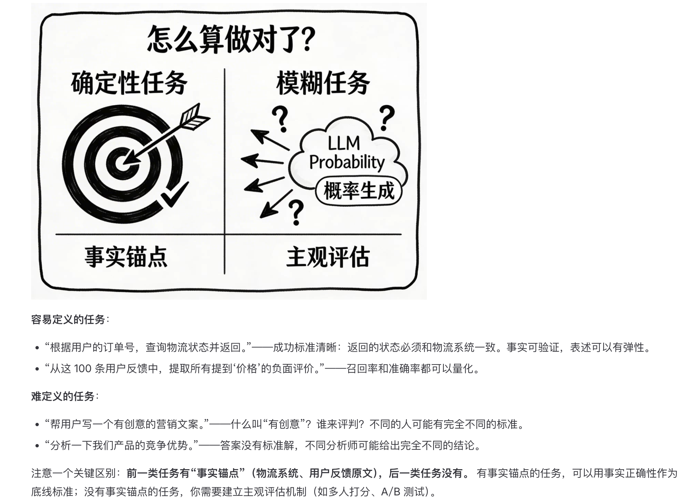
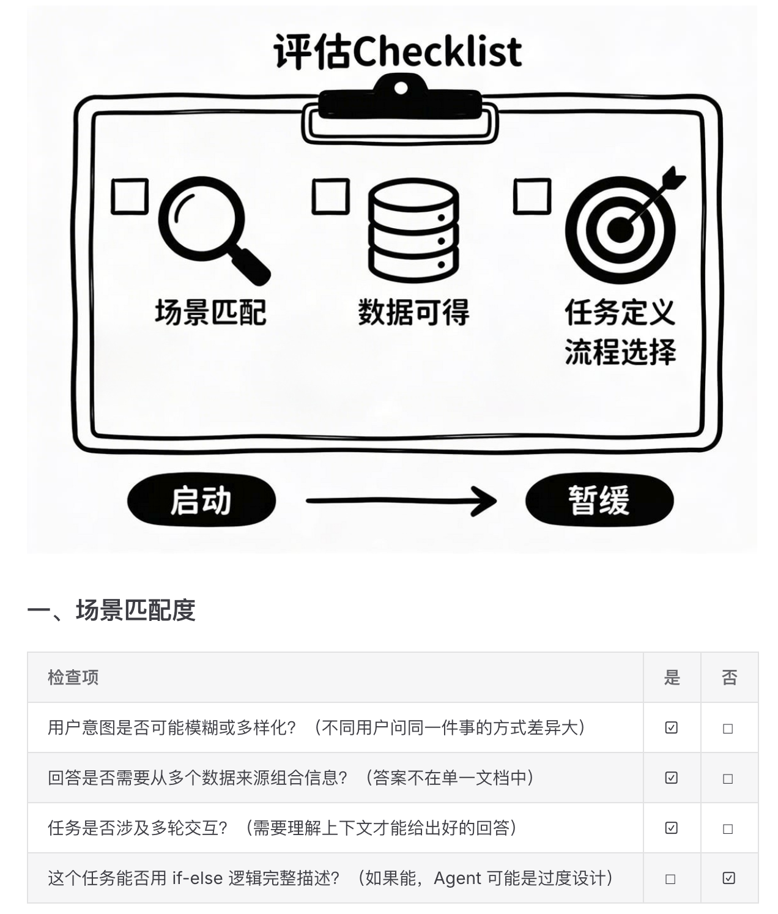

## Takeaway
关于什么时候该用ai（需求场景、开发数据、交付可定义），该如何使用ai（workflow——human in the loop——harness）

## 学习过程中的随笔

  
01
对于过度工程化这个有不同的看法，从用户体验和 ROI 来评估，确实不应该事事都用 ai。但是在实践中，为了快速满足上级的一些敏捷开发需求，把所有东西都丢给大模型兜底确实是一个短期的权宜之计，也算是一张遮羞布了。

  <figure class="note-figure is-wide">
    <figcaption>02
最近的一个困扰确实是，如何在资源有限的情况下，写出统一团队 AI 认知和交付需求的验收标准。在没有足够数据集的情况下，只能提供理想的正确输出，但是很难想到各种需要禁止的边界情况。
</figcaption>
    
  </figure>
  
03
关于 workflow 和 agent 上，除了考虑任务的灵活性，其实还有一个需要考量的点——团队协作。workflow 毕竟清晰直观，产品和开发都可以通过低代码平台查看和调试；如果是 agent，协作和调试的难度会大大提高。

  <figure class="note-figure is-wide">
    <figcaption>04
评估是否应该使用 ai 的 checklist：是否有模糊地带（无法 if-else 逻辑判定）、是否有准确的数据、是否是可定义可验证的。我觉得场景匹配除了模糊性，其实还有耗时和 ROI 的考量，毕竟 AI 每次回应都是要时间和金钱的呀。
</figcaption>
    
  </figure>

